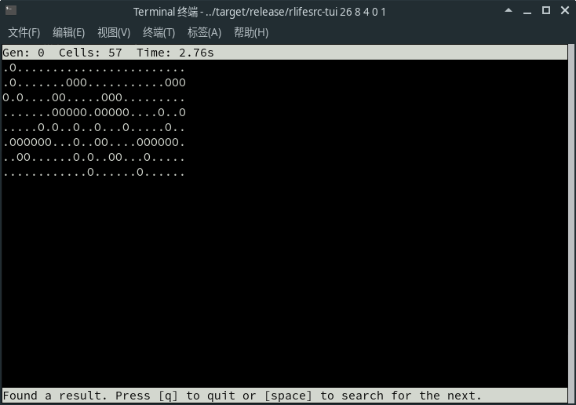

# [rlifesrc](https://alephalpha.github.io/rlifesrc/)

试玩 Rust。尝试写一个生命游戏搜索工具。具体来说就是照抄 David Bell 写的 [lifesrc](https://github.com/DavidKinder/Xlife/tree/master/Xlife35/source/lifesearch)。其具体的算法可见 [Dean Hickerson 的说明](https://github.com/DavidKinder/Xlife/blob/master/Xlife35/source/lifesearch/ORIGIN)。

由于是从一种没学过的语言（C）抄到一种没用过的语言（Rust），而且在不懂 javascript 的情况下弄成一个网页，写得非常糟糕，和原版的 lifesrc 相比缺少很多功能，但支持 non-totalistic 的规则，而且速度要快一些（网页版除外）。

支持 [Life-like](http://conwaylife.com/wiki/Totalistic_Life-like_cellular_automaton) 和 [Isotropic non-totalistic](http://conwaylife.com/wiki/Isotropic_non-totalistic_Life-like_cellular_automaton) 的规则，但后者比前者要略慢一些。

[点此试用网页版。](https://alephalpha.github.io/rlifesrc/)

* [编译](#编译)
  * [编译原生版](#编译原生版)
  * [编译网页版](#编译网页版)
* [用法](#用法)
  * [命令行界面](#命令行)
  * [文本界面（TUI）](#文本界面)
  * [网页版](#网页版)

## 编译

这是用 Rust 写的。没有 Rust 的话，先安装 [Rust](https://www.rust-lang.org/)。

无论是编译，还是用 `cargo` 来运行，一定要记得加上 `--release`，不然会特别慢，相差大约一百倍。

文本界面是用 [pancurses](https://github.com/ihalila/pancurses) 写的，在编译之前请参照 [ncurses-rc](https://github.com/jeaye/ncurses-rs)（Unix-like）或 [pdcurses-sys](https://github.com/ihalila/pdcurses-sys)（Windows） 的说明来安装相应的依赖。如果只需要网页版，不必安装这些依赖。

准备好了之后，就可以用 `git clone` 下载：

```bash
git clone https://github.com/AlephAlpha/rlifesrc.git
cd rlifesrc/
```

### 编译原生版

原生版（文本界面和命令行界面）在 `tui` 目录中，编译之前要先 `cd` 到该目录（否则会尝试把网页版编译成机器码，而导致出错）。

```bash
cd tui/
RUSTFLAGS="-C target-cpu=native" cargo build --release
```

编译需要一定时间，请耐心等待。

编译好的文件是 `./target/release/rlifesrc-tui`。

### 编译网页版

网页版在 `web` 目录中。

网页版无法编译成机器码，只能编译成 WebAssembly，因此需要先安装 [cargo-web](https://github.com/koute/cargo-web)。

安装了 cargo-web 之后，用

```bash
cd web/
cargo web build --release
```

来编译即可。记得一定要 `cd` 到 `web` 目录。

由于用了 Web Worker，需要编译两个文件，无法直接使用 `cargo web start` 来运行，或者用 `cargo web deploy` 编译成静态网页。只能在编译之后手动把 `target/wasm32-unknown-unknown/release/` 文件夹里的以 `*.js` 和 `*.wasm` 结尾的四个文件，以及 `static` 中的两个文件，复制到同一个文件夹：

```bash
mkdir -p some_folder/
cp ../target/wasm32-unknown-unknown/release/*.{js,wasm} some_folder/
cp static/* some_folder/
```

然后就可以把这个文件夹中的内容部署到自己的网站，比如说 GitHub Pages。注意由于[此问题](https://developer.mozilla.org/zh-CN/docs/Web/HTTP/CORS/Errors/CORSRequestNotHttp)，无法直接在浏览器打开 `index.html` 来运行；至少火狐浏览器如此。

## 用法

这个算法适合搜索小周期的宽扁或者瘦高的图样，但理论上也能搜别的图样。支持 Life-like 和 Isotropic non-totalistic 的规则。

原生版需要[下载和编译](#编译)，它提供[命令行](#命令行)和[文本（TUI）](#文本界面)两种界面。编译好的文件是 `./target/release/rlifesrc-tui`。也可以在 `tui` 目录中用 `cargo run --release` 来运行（不加 `--release` 的话会特别慢）。其用法如下：

```plaintext
USAGE:
    rlifesrc [FLAGS] [OPTIONS] <X> <Y> [ARGS]

FLAGS:
    -a, --all
            搜索所有的满足条件的图样
            仅适用于命令行界面

    -n, --no-tui
            不进入文本界面，直接开始搜索
            此即命令行界面

    -f, --front
            强制要求第一行/第一列非空

        --reset-time
            开始新的搜索时重置计时
            仅适用于文本界面

    -h, --help
            显示此帮助信息的英文版

    -V, --version
            显示版本信息（永远是 0.1.0）


OPTIONS:
    -c, --choose <CHOOSE>
            如何为未知的细胞选取状态
             [默认: dead]  [可能的值: dead, alive, random, d, a, r]

    -m, --max <MAX>
            第一代活细胞个数的极大值
            如果这个值设为 0，则不限制活细胞的个数。
             [默认: 0]


    -o, --order <ORDER>
            搜索顺序
            先搜行还是先搜列。
             [默认: automatic]  [可能的值: row, column, automatic, r, c, a]

    -r, --rule <RULE>
            元胞自动机的规则
            支持 Life-like 和 Isotropic non-totalistic 的规则
             [默认: B3/S23]

    -s, --symmetry <SYMMETRY>
            图样的对称性
            其中一些对称性可能需要加上引号。
            这些对称性的用法和 Oscar Cunningham 的 Logic Life Search 一样。
            详见 http://conwaylife.com/wiki/Symmetry
             [默认: C1]  [可能的值: C1, C2, C4, D2|, D2-, D2\, D2/, D4+, D4X, D8]

    -t, --transform <TRANSFORM>    
            图样的变换
            图样在一个周期之后如何变换（旋转或翻转）。每周期先进行此变换，再进行平移。
            其中一些变换可能需要加上引号。
            "Id" 表示恒等变换。
            "R" (Rotate) 表示逆时针旋转。
            "F" (Flip) 表示沿某轴线翻转。
             [默认: Id]  [可能的值: Id, R90, R180, R270, F|, F-, F\, F/]


ARGS:
    <X>
            图样的宽度

    <Y>
            图样的高度

    <P>
            图样的周期 [默认: 1]

    <DX>
            水平方向的平移 [默认: 0]

    <DY>
            竖直方向的平移 [默认: 0]
```

比如说，要想找到 [25P3H1V0.1](http://conwaylife.com/wiki/25P3H1V0.1)，可以用：

```bash
./target/release/rlifesrc 16 5 3 0 1
```

网页版涉及到的参数和选项与此类似，不过是直接在网页中输入，并点击 “Set World” 确认。

10 种不同的对称性，对应二面体群 D8 的 10 个子群。对称性的用法和 Oscar Cunningham 的 Logic Life Search 一样，详见 [Life Wiki 上的相应说明](http://conwaylife.com/wiki/Symmetry)。

8 种不同的变换，对应二面体群 D8 的 8 个元素。`Id` 表示恒等变换。`R` 表示旋转（Rotate）， 后面的数字表示逆时针旋转的角度。`F` 表示翻转（Flip）， 后面的符号表示翻转的轴线。比如说，如果想要搜索竖直方向的 [glide symmetric](http://www.conwaylife.com/wiki/Types_of_spaceships#Glide_symmetric_spaceship) 的飞船，变换可以设成 `F|`。

注意有些变换和对称性要求世界是正方形。在网页版中，如果世界的宽和高不一致，这些变换和对称性将无法选取；如果已经选取了这样的变换或对称性，在更改宽或高时另一个值也会随之变化。

搜索顺序中的 “Automatic” 指的是先搜窄的一边。也就是说，行比列少先搜列，列比行少先搜行。

`MAX` 指的是第一代（确切地说应该是第 0 代）活细胞个数的极大值。其中用 0 表示无穷大。

### 命令行

命令行界面是最简单的界面，功能只有输入命令，输出结果，不会显示搜索过程。

结果以 [Plaintext](http://conwaylife.com/wiki/Plaintext) 格式输出，用 `.` 表示死细胞，`O` 表示活细胞。

比如说，输入

```bash
./target/release/rlifesrc-tui 26 8 4 0 1 -c a --no-tui
```

会显示以下结果：

```plaintext
.O........................
.O.......OOO...........OOO
O.O....OO.....OOO.........
.......OOOOO.OOOOO....O..O
.....O.O..O..O...O.....O..
.OOOOOO...O..OO....OOOOOO.
..OO......O.O..OO...O.....
............O......O......
```

加上命令行选项 `--all` 会一个一个地输出所有的结果。

### 文本界面

文本界面也十分简陋，但可以显示搜索过程和搜索所用的时间。

刚进入文本界面的时候，大概是这个样子（以 `./target/release/rlifesrc-tui 26 8 4 0 1 -c a` 为例）：


其中 `?` 表示未知的细胞。`Cells` 表示第 0 代中已知的活细胞数。

然后按空格键或回车键开始/暂停搜索，按 q 键退出，按左右方向键显示图样的上一代/下一代。注意此用法和原版的 lifesrc 并不一样。

搜索到的结果同样以 Plaintext 格式显示，如下图：



此时再按空格键或回车键的话会在当前结果的基础上搜下一个结果。

搜索过程中不会显示搜索时间。搜索下一个结果时不会重置计时，除非加上命令行选项 `--reset-time`。

如果搜索的图样比终端的窗口大小还要大，将无法完整显示。这是文本界面最主要的缺陷。

### 网页版

由于网页版是编译成 WebAssembly 而不是机器码，速度要慢很多，但随时随地只要有浏览器就能运行。

进入页面后按照说明调整图样的宽度、高度、周期、平移等信息，然后点击 “Set World” 来确定这些信息。然后点 “Start” 开始搜索。

搜到结果后再点 “Start” 会在当前结果的基础上搜下一个结果。如果要从头开始搜索，可以点击 “Set World” 来重置世界。

其余的用法和文本界面差不多。
