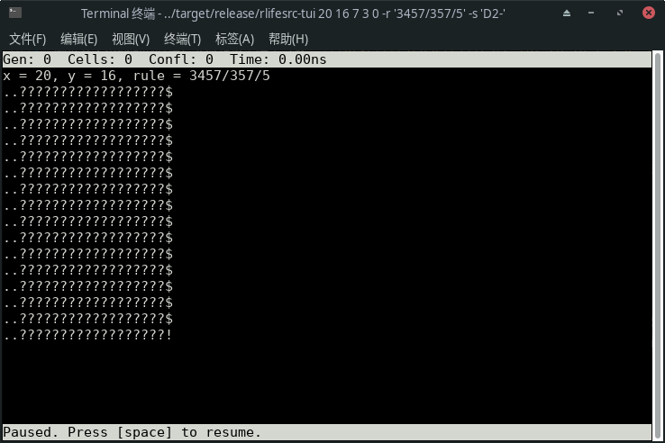

# [rlifesrc-tui](https://alephalpha.github.io/rlifesrc/)

试玩 Rust。尝试写一个生命游戏搜索工具。具体来说就是照抄 David Bell 写的 [lifesrc](https://github.com/DavidKinder/Xlife/tree/master/Xlife35/source/lifesearch) 和 Jason Summers 写的 [WinLifeSearch](https://github.com/jsummers/winlifesearch/)。其具体的算法可见 [Dean Hickerson 的说明](https://github.com/DavidKinder/Xlife/blob/master/Xlife35/source/lifesearch/ORIGIN)。

由于是从一种没学过的语言（C）抄到一种没用过的语言（Rust），写得非常糟糕，和 WinLifeSearch 相比缺少很多功能，而且速度要慢很多，但支持更多规则。

支持 [Life-like](https://conwaylife.com/wiki/Totalistic_Life-like_cellular_automaton) 和 [non-totalistic](https://conwaylife.com/wiki/Non-isotropic_Life-like_cellular_automaton) 的规则，但后者比前者要略慢一些。也支持[六边形](https://conwaylife.com/wiki/Hexagonal_neighbourhood)以及[von Neumann 邻域](https://conwaylife.com/wiki/Von_Neumann_neighbourhood)的规则，但目前是通过转化成 non-totalistic 规则来实现的，速度较慢。还支持 [Generations](https://conwaylife.com/wiki/Generations) 规则，此功能是实验性的，可能有 bug。

这里是 rlifesrc 的命令行界面和文本界面。网页版的说明见[`web/`](../web/README.md) 目录中的 `README.md`。

* [编译](#编译)
* [用法](#用法)
  * [命令行界面](#命令行)
  * [文本界面（TUI）](#文本界面)

## 编译

这是用 Rust 写的。没有 Rust 的话，先安装 [Rust](https://www.rust-lang.org/)。

无论是编译，还是用 `cargo` 来运行，一定要记得加上 `--release`，不然会特别慢，相差大约一百倍。

文本界面是用 [pancurses](https://github.com/ihalila/pancurses) 写的，在编译之前请参照 [ncurses-rc](https://github.com/jeaye/ncurses-rs)（Unix-like）或 [pdcurses-sys](https://github.com/ihalila/pdcurses-sys)（Windows） 的说明来安装相应的依赖。如果只需要网页版，不必安装这些依赖。

准备好了之后，就可以用 `git clone` 下载：

```bash
git clone https://github.com/AlephAlpha/rlifesrc.git
cd rlifesrc/
```

原生版（文本界面和命令行界面）在 `tui` 目录中，编译之前要先 `cd` 到该目录（否则会尝试把网页版编译成机器码，从而出错）。

```bash
cd tui/
RUSTFLAGS="-C target-cpu=native" cargo build --release
```

编译需要一定时间，请耐心等待。

编译好的文件是 `./target/release/rlifesrc-tui`。

## 用法

这个算法适合搜索小周期的宽扁或者瘦高的图样，但理论上也能搜别的图样。支持 Life-like 和 Isotropic non-totalistic 的规则。

原生版需要[下载和编译](#编译)，它提供[命令行](#命令行)和[文本（TUI）](#文本界面)两种界面。编译好的文件是 `./target/release/rlifesrc-tui`。也可以在 `tui` 目录中用 `cargo run --release` 来运行（不加 `--release` 的话会特别慢）。其用法如下：

```plaintext
USAGE:
    rlifesrc [FLAGS] [OPTIONS] <X> <Y> [ARGS]

FLAGS:
    -a, --all
            搜索所有的满足条件的图样
            仅适用于命令行界面

    -n, --no-tui
            不进入文本界面，直接开始搜索
            此即命令行界面

    -f, --front
            强制要求第一行/第一列非空

        --reset-time
            开始新的搜索时重置计时
            仅适用于文本界面

        --reduce
            搜到结果时自动缩小活细胞个数的上界

    -h, --help
            显示此帮助信息的英文版

    -V, --version
            显示版本信息（永远是 0.1.0）


OPTIONS:
    -c, --choose <CHOOSE>
            如何为未知的细胞选取状态
             [默认: dead]  [可能的值: dead, alive, random, d, a, r]

    -m, --max <MAX>
            活细胞个数的上界（只考虑活细胞最少的一代）
            如果这个值设为 0，则不限制活细胞的个数。
             [默认: 0]


    -o, --order <ORDER>
            搜索顺序
            先搜行还是先搜列。
             [默认: automatic]  [可能的值: row, column, automatic, r, c, a]

    -r, --rule <RULE>
            元胞自动机的规则
            支持 Life-like 和 Isotropic non-totalistic 的规则，
            以及相应的 Generations 规则
             [默认: B3/S23]

    -s, --symmetry <SYMMETRY>
            图样的对称性
            其中一些对称性可能需要加上引号。
            这些对称性的用法和 Oscar Cunningham 的 Logic Life Search 一样。
            详见 http://conwaylife.com/wiki/Symmetry
             [默认: C1]  [可能的值: C1, C2, C4, D2|, D2-, D2\, D2/, D4+, D4X, D8]

    -t, --transform <TRANSFORM>    
            图样的变换
            图样在一个周期之后如何变换（旋转或翻转）。每周期先进行此变换，再进行平移。
            其中一些变换可能需要加上引号。
            "Id" 表示恒等变换。
            "R" (Rotate) 表示逆时针旋转。
            "F" (Flip) 表示沿某轴线翻转。
             [默认: Id]  [可能的值: Id, R90, R180, R270, F|, F-, F\, F/]


ARGS:
    <X>
            图样的宽度

    <Y>
            图样的高度

    <P>
            图样的周期 [默认: 1]

    <DX>
            水平方向的平移 [默认: 0]

    <DY>
            竖直方向的平移 [默认: 0]
```

比如说，要想找到 [25P3H1V0.1](http://conwaylife.com/wiki/25P3H1V0.1)，可以用：

```bash
./target/release/rlifesrc 16 5 3 0 1
```

10 种不同的对称性，对应二面体群 D8 的 10 个子群。对称性的用法和 Oscar Cunningham 的 Logic Life Search 一样，详见 [Life Wiki 上的相应说明](http://conwaylife.com/wiki/Symmetry)。

8 种不同的变换，对应二面体群 D8 的 8 个元素。`Id` 表示恒等变换。`R` 表示旋转（Rotate）， 后面的数字表示逆时针旋转的角度。`F` 表示翻转（Flip）， 后面的符号表示翻转的轴线。比如说，如果想要搜索竖直方向的 [glide symmetric](http://conwaylife.com/wiki/Types_of_spaceships#Glide_symmetric_spaceship) 的飞船，变换可以设成 `F|`。

注意有些变换和对称性要求世界是正方形。在网页版中，如果世界的宽和高不一致，这些变换和对称性将无法选取；如果已经选取了这样的变换或对称性，在更改宽或高时另一个值也会随之变化。

搜索顺序中的 “Automatic” 指的是先搜窄的一边。也就是说，行比列少先搜列，列比行少先搜行。

`MAX` 指的是第一代（确切地说应该是第 0 代）活细胞个数的极大值。其中用 0 表示无穷大。

### 命令行

命令行界面是最简单的界面，功能只有输入命令，输出结果，不会显示搜索过程。

输出的结果用 Golly 的 [Extended RLE](http://golly.sourceforge.net/Help/formats.html#rle) 格式显示；但不会合并相邻的相同符号，而是采用类似于 [Plaintext](https://conwaylife.com/wiki/Plaintext) 格式的排版。

对于两种状态的规则，用 `.` 表示死细胞，`o` 表示活细胞；对于超过两种状态的 Generations 规则，用 `.` 表示死细胞，`A` 表示活细胞，`B` 及以后的字母表示正在死亡的细胞。目前无法正常显示大于 25 种状态的 Generations 规则。

比如说，输入

```bash
./target/release/rlifesrc-tui 20 16 7 3 0 -r '3457/357/5' -s 'D2-' --no-tui
```

会显示以下结果：

```plaintext
x = 20, y = 16, rule = 3457/357/5
....................$
..........B...AAA...$
........ACAC.AAAB.D.$
.......AABDB.AACDC..$
.....ABACCCDA.BAAC..$
....DABACCCBAAABA...$
...AA..AAABDDBAAD...$
..AAA...AA.CDAB.....$
..AAA...AA.CDAB.....$
...AA..AAABDDBAAD...$
....DABACCCBAAABA...$
.....ABACCCDA.BAAC..$
.......AABDB.AACDC..$
........ACAC.AAAB.D.$
..........B...AAA...$
....................!
```

加上命令行选项 `--all` 会一个一个地输出所有的结果。

### 文本界面

文本界面也十分简陋，但可以显示搜索过程和搜索所用的时间。

刚进入文本界面的时候，大概是这个样子（以 `./target/release/rlifesrc-tui 20 16 7 3 0 -r '3457/357/5' -s 'D2-'` 为例）：



其中 `?` 表示未知的细胞。`Cells` 表示当前代中已知的活细胞数。`Confl` 表示搜索中经历的总冲突数，可以理解为搜索的步数。

然后按空格键或回车键开始/暂停搜索，按 q 键退出，按左右方向键显示图样的上一代/下一代。注意此用法和原版的 lifesrc 并不一样。

搜索到的结果同样以 Plaintext 格式显示，如下图：


此时再按空格键或回车键的话会在当前结果的基础上搜下一个结果。

搜索过程中不会显示搜索时间，若想知道时间可以暂停。搜索下一个结果时不会重置计时，除非加上命令行选项 `--reset-time`。

如果搜索的图样比终端的窗口大小还要大，将无法完整显示。这是文本界面最主要的缺陷。此时可以使用网页版。

