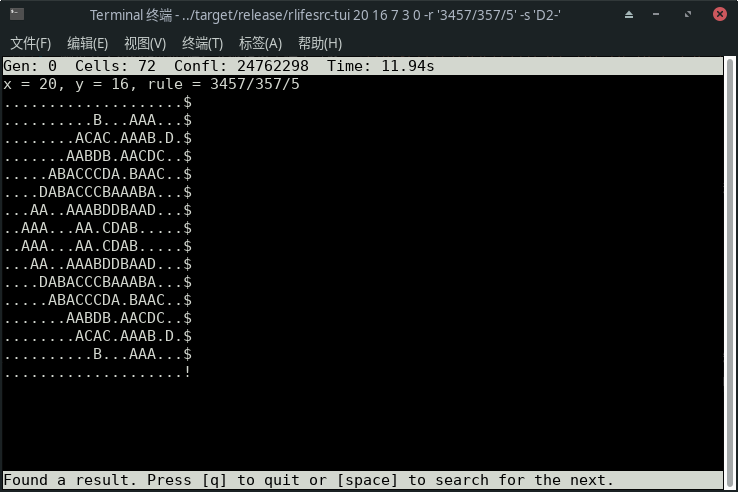

# [rlifesrc](https://github.com/AlephAlpha/rlifesrc)

[](https://travis-ci.org/AlephAlpha/rlifesrc) [](https://crates.io/crates/rlifesrc) [](README.md)

__Rust Life Search__, or __rlifesrc__, is a Game of Life pattern searcher written in Rust.

The program is based on David Bell's [lifesrc](https://github.com/DavidKinder/Xlife/tree/master/Xlife35/source/lifesearch) and Jason Summers's [WinLifeSearch](https://github.com/jsummers/winlifesearch/), using [an algorithm invented by Dean Hickerson](https://github.com/DavidKinder/Xlife/blob/master/Xlife35/source/lifesearch/ORIGIN).

Compared to WinLifeSearch, rlifesrc is still slower, and lacks many important features. But it supports non-totalistic Life-like and Generations rules. Supports for Generations rules are experimental.

This is the command-line tool and the TUI. There is also a [web app complied to WASM](https://github.com/AlephAlpha/rlifesrc/tree/master/web).


- [rlifesrc](#rlifesrc)
  - [Installation](#installation)
  - [Usage](#usage)
    - [CLI](#cli)
    - [TUI](#tui)
  - [Compiling](#compiling)

## Installation

rlifesrc is written in [Rust](https://www.rust-lang.org/). You can install it with Rust's package manager, Cargo:

```bash
cargo install rlifesrc
```

If you want to compile from the source code, please see the [Compiling](#compiling) part.

## Usage

This algorithm is suitable for long and thin or flat and wide patterns, but it can also search for other patterns.

It provides two interfaces: a [simple command line interface](#cli) and a [text-based user interface](#tui).

```plaintext
USAGE:
    rlifesrc [FLAGS] [OPTIONS] <X> <Y> [ARGS]

FLAGS:
    -a, --all
            Prints all possible results instead of only the first one
            Only useful when --no-tui is set.

    -f, --front
            Force the first row or column to be nonempty
            Here 'front' means the first row or column to be searched, according to the search order.

    -n, --no-tui
            Starts searching immediately, without entering the TUI

        --reduce
            Reduce the max cell count when a result is found
            The new max cell count will be set to the cell count of the current result minus one.

        --reset-time
            Resets the time when starting a new search

    -h, --help
            Prints help information

    -V, --version
            Prints version information


OPTIONS:
    -c, --choose <CHOOSE>
            How to choose a state for unknown cells
             [default: alive]  [possible values: dead, alive, random, d, a, r]

        --diag <DIAG>              
            Diagonal width
            If the diagonal width is n > 0, the cells at position (x, y) where
            abs(x - y) >= n are assumed to be  dead.
            If this value is set to 0, it would be ignored.
             [default: 0]

    -m, --max <MAX>
            Upper bound of numbers of minimum living cells in all generations
            If this value is set to 0, it means there is no limitation.
             [default: 0]

    -o, --order <ORDER>
            Search order
            Row first or column first, or diagonal.
             [default: automatic]  [possible values: row, column, automatic, diagonal, r, c, a, d]

    -r, --rule <RULE>
            Rule of the cellular automaton
            Supports Life-like, isotropic non-totalistic, hexagonal, MAP rules, and their
            corresponding Generations rules.
             [default: B3/S23]

    -s, --symmetry <SYMMETRY>
            Symmetry of the pattern
            You may need to add quotation marks for some of the symmetries.
            The usages of these symmetries are the same as Oscar Cunningham's Logic Life Search.
            See [https://conwaylife.com/wiki/Symmetry]
             [default: C1]  [possible values: C1, C2, C4, D2|, D2-, D2\, D2/, D4+, D4X, D8]

    -t, --transform <TRANSFORM>
            Transformation of the pattern
            After the last generation in a period, the pattern will return to the first generation, applying this transformation first, and then the translation defined by DX and DY.
            You may need to add quotation marks for some of the transformations.
            "Id" is the identical transformation.
            "R" means counterclockwise rotation.
            "F" means flipping (reflection) across an axis.
             [default: Id]  [possible values: Id, R90, R180, R270, F|, F-, F\, F/]

ARGS:
    <X>
            Width of the pattern

    <Y>
            Height of the pattern

    <P>
            Period of the pattern [default: 1]

    <DX>
            Horizontal translation [default: 0]

    <DY>
            Vertical translation [default: 0]
```

For example, this will find [25P3H1V0.1](https://conwaylife.com/wiki/25P3H1V0.1)：

```bash
rlifesrc 16 5 3 0 1
```

10 different symmetries correspond to the 10 subgroups of the dihedral group _D_<sub>8</sub>. The notations are stolen from Oscar Cunningham's [Logic Life Search](https://github.com/OscarCunningham/logic-life-search). Please see the [Life Wiki](https://conwaylife.com/wiki/Symmetry) for details.

8 different transformations correspond to the 10 elements of the dihedral group _D_<sub>8</sub>. Here:

* `Id` means the identity transformation.
* `R` means rotations around the center of the world. The number after it is the counterclockwise rotation angle in degrees.
* `F` means reflections (flips). The symbol after it is the axis of reflection.

For example, if you want to find a vertical spaceship with [glide symmetric](https://conwaylife.com/wiki/Types_of_spaceships#Glide_symmetric_spaceship), you can set the transformation to `F|`.

Some of the symmetries and transformations are only valid when the world is square.

“Automatic” in the search order means that it will start from the shorter side, i.e., start from the columns if there are more columns than rows, from the rows if there are more rows than columns. It will never choose the diagonal search order.

Diagonal search order requires  that the world is square.

### CLI

The command line interface (CLI) is the simplest interface. You input the commands, and it will print the result, without showing the search process.

The result is printed in a mix of [Plaintext](https://conwaylife.com/wiki/Plaintext) and [RLE](https://conwaylife.com/wiki/Rle) format. Specifically:

* **Dead** cells are represented by `.`;
* **Living** cells are represented by `o` for rules with 2 states,
  `A` for rules with more states;
* **Dying** cells are represented by uppercase letters starting from `B`;
* **Unknown** cells are represented by `?`;
* Each line is ended with `$`;
* The whole pattern is ended with `!`.

Currently it cannot properly display Generations rules with more than 25 states.

For example, this input:

```bash
rlifesrc 20 16 7 3 0 -r '3457/357/5' -s 'D2-' --no-tui
```

will give:

```plaintext
x = 20, y = 16, rule = 3457/357/5
....................$
..........B...AAA...$
........ACAC.AAAB.D.$
.......AABDB.AACDC..$
.....ABACCCDA.BAAC..$
....DABACCCBAAABA...$
...AA..AAABDDBAAD...$
..AAA...AA.CDAB.....$
..AAA...AA.CDAB.....$
...AA..AAABDDBAAD...$
....DABACCCBAAABA...$
.....ABACCCDA.BAAC..$
.......AABDB.AACDC..$
........ACAC.AAAB.D.$
..........B...AAA...$
....................!
```

With the command line flag `--all`, it will print all the results one by one.

### TUI

The text-based user interface (TUI) is also simple, but it will show the search progress and the search time.

The TUI is written with [crossterm](https://github.com/crossterm-rs/crossterm). Theoretically it should be cross platform, but I have only tested it on Xfce Terminal.

When you enter the TUI, it looks like this (taking `rlifesrc 20 16 7 3 0 -r '3457/357/5' -s 'D2-'` as an example):


The output format during the search is the same as that of the CLI, except that `?` means unknown cells.

`Cells` means the number of known living cells in the current generation. For Generations rules, dying cells are not counted. `Confl` means the number of conflicts during the search, which can be understood of the number of steps.

Press the space bar or `Enter` to start or pause the search, `q` to quit, Page up (Page down) to show the last (the next) generation. Note that the usage of the keys is different from the original lifesrc.

The search result looks like this:



If you press the space bar or `Enter` again, it will start to search the next result.

The time is only shown when the search is paused. It will not be reset when starting a new search, unless the command line flag `--reset-time` is added.

rlifesrc is unable to display the whole pattern when it is larger than the terminal size. But the whole result will be printed after quitting the program.

## Compiling

rlifesrc is written in [Rust](https://www.rust-lang.org/). So first you need to install Rust.

And then you can download and compile:

```bash
git clone https://github.com/AlephAlpha/rlifesrc.git
cd rlifesrc/
RUSTFLAGS="-C target-cpu=native" cargo build --release
```

The output file is `./target/release/rlifesrc`.

If you don't need the TUI, you can add the flag `--no-default-features` to cargo-build.
